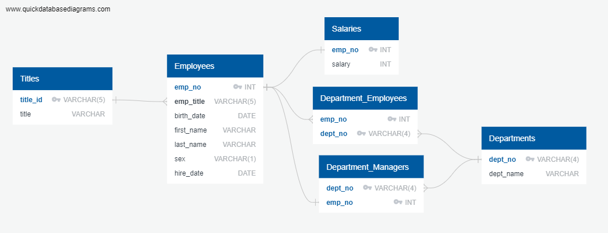
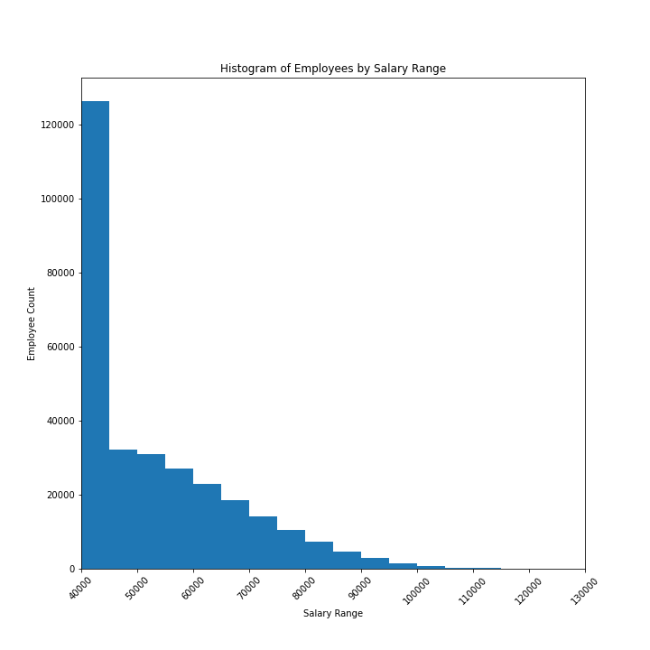
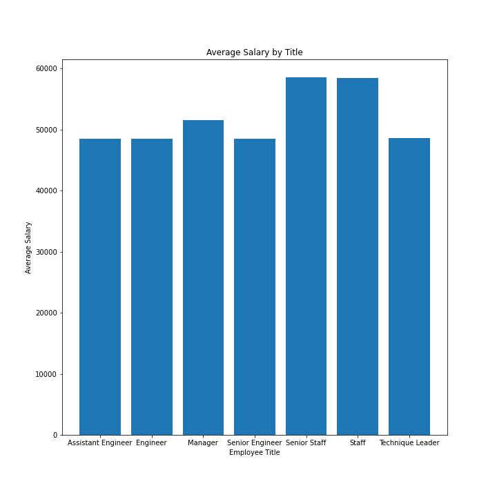

# GT Bootcamp SQL Homework: Employee Database

## Table of Contents
1. [Introduction](#introduction)
2. [Objectives](#objectives)
3. [Technologies](#technologies)
4. [Files](#files)
5. [Analysis](#analysis)

### Introduction
As the newest data engineer at Pewlett Hackard, I have been tasked with researching employees of the coporation from the 1980s and 1990s using only the remaining six CSV files from those years. I must perform both Data Engineering and Data Analysis on the dataset. I have a sneaking suspicion that something isn't right here...

### Objectives

* Sketch out an ERD of the tables.
* Write an SQL script that creates the tables in the PostgreSQL database.
* Write an SQL script that runs requested queries.
* Use Python in Jupyter Notebook to connect to the PostgreSQL database and pull query results into dataframes.
* Plot dataframes to further investigate the data.

### Technologies
This project uses: 
* PostgreSQL
* Python Version 3.6.13
* Jupyter Notebook Version 6.1.4
* Psycopg2-binary Version 2.9.1

### Files

* [Data Folder](EmployeeSQL/data): folder containing all CSVs that remain from 1980/1990 employee data
* [schema.sql](EmployeeSQL/schema.sql): sql code used to create the table structures in the database
* [queries.sql](EmployeeSQL/queries.sql): sql code used to query the database to answer the various questions
* [Bonus Analysis](EmployeeSQL/Bonus_Analysis.ipynb): Jupyter Lab file that connects to database, pulls query results into dataframes, and creates various plots
* [Jupyter Notebook Viewer of Bonus Analysis](https://nbviewer.jupyter.org/github/khutula/sql-challenge/blob/main/EmployeeSQL/Bonus_Analysis.ipynb): use this link to view the Bonus Analysis Jupyter Lab file in a friendly viewer version

### Analysis

Above, you can see my entity relationship diagram (ERD), which visually represents the relationships within the database that was created. I used this sketch to help me create the code in [schema.sql](EmployeeSQL/schema.sql).

----

Above, you can see the histogram of salaries within the company during the 80s and 90s. It is extremely heavily concentrated in the $40,000 to $45,000 bin (the lowest salary range). Salaries range from $40,000 to $130,000 at decreasing frequencies. This data seems a little too perfect to be true.

----

Above, you can see the bar chart of average salary by job title.  Overall, it seems that the average salaries for all job titles are very similar, which is not expected. You would expect to see quite different salaries when comparing an Assistant Engineer, an Engineer, and a Senior Engineer, but this is not what is being shown by the data. All three of these average salaries appear virtually equal. This is very suspicious.

----
Finally, after my boss informed me that my employee number was 499942, I immediately pulled all information related to that from the database...only to reveal that "my name" is April Foolsday...I knew the data was fake all along!
